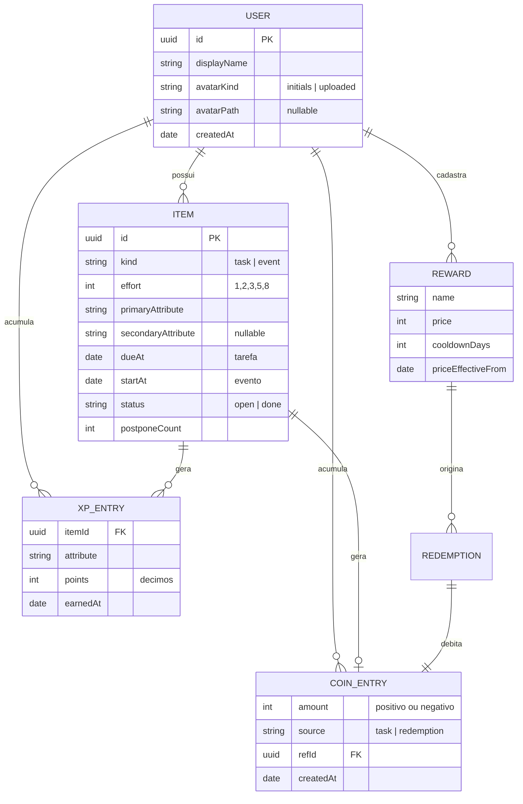
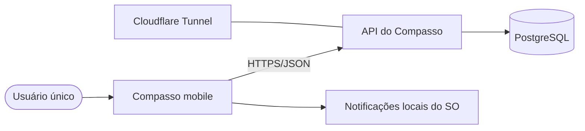
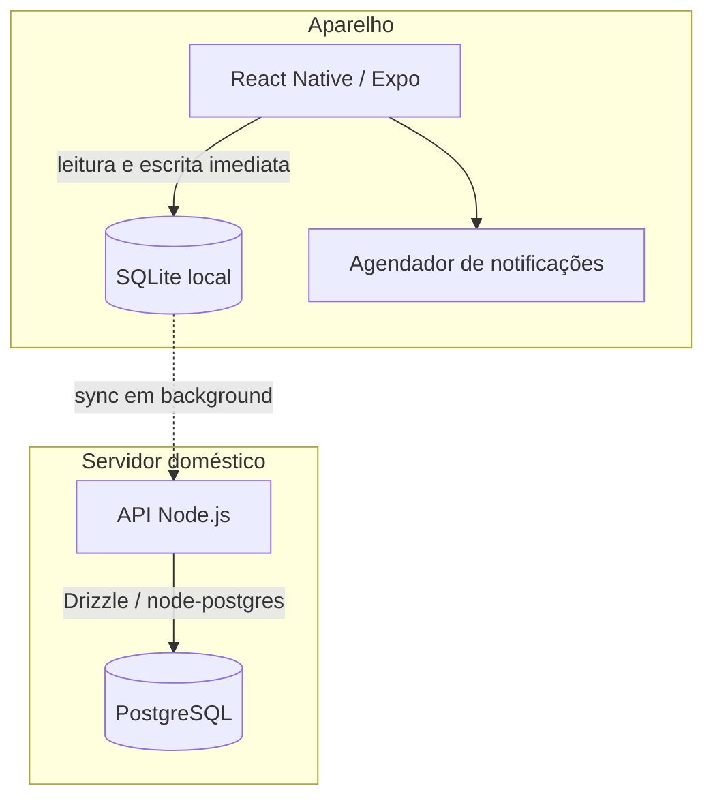
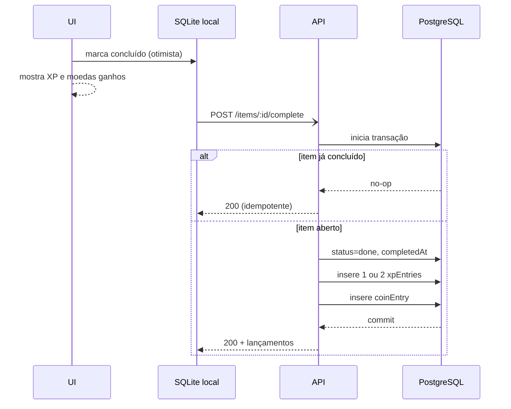

# Compasso — Especificação Técnica — v1

> Documento de especificação, não de arquitetura implementada. A implementação começou (F0 e F1
> do [roadmap](roadmap.md)); onde o código precisou decidir algo que este documento deixava em
> aberto, a decisão está em [`adr/`](adr/) ou em [`sincronizacao.md`](sincronizacao.md). Toda
> seção marcada com `PROPOSTA` é sugestão sujeita a revisão; `DECIDIDO` já foi acordado.
>
> **Nome:** Compasso. `DECIDIDO`.

---

## 1. Propósito

**Compasso** é um app pessoal que acumula dois papéis: **o calendário principal da pessoa** e um
registrador de esforço que mostra, ao longo do tempo, em que áreas da vida esse esforço está sendo
gasto. Construído primeiro para o próprio autor e, mais adiante, disponibilizado para um punhado de
amigos próximos — cada um com sua conta isolada, sem nada que os conecte dentro do Compasso.

Os dois papéis convivem numa entidade só e é isso que dá sentido ao conjunto: o compromisso que
você tem que cumprir e a tarefa pela qual você ganha pontos aparecem no mesmo dia, na mesma tela,
disputando as mesmas horas. Um app de tarefa que ignora a agenda mente sobre o tempo disponível.

A diferença em relação a qualquer app de tarefa pronto não é a lista: é a camada de medição. Cada
tarefa carrega uma estimativa de esforço declarada **antes** da execução e alimenta um ou dois
atributos de vida (Corpo, Mente, Ofício, Casa, Social). O acúmulo desses pontos vira um radar que
responde a pergunta que uma lista de tarefas não responde: *estou negligenciando alguma área?*

A segunda camada é econômica. Concluir tarefas gera moeda; a moeda compra recompensas reais que o
próprio usuário cadastra. É o único elemento do sistema que fecha um ciclo fora do Compasso.

O sistema deliberadamente **não** pune. Não há decaimento de atributo, não há streak, não há
penalidade por atraso. A única consequência de não fazer uma tarefa é não ganhar nada por ela.
Isso é uma decisão de produto, não uma simplificação: mecânicas de perda produzem ansiedade e
abandono em apps de uso pessoal, e abandono é o modo de falha real aqui.

## 2. Restrições e premissas

- **Multiusuário na estrutura, conta única no uso.** A v1 roda com uma conta só, criada
  manualmente, mas o Compasso será aberto para alguns amigos próximos depois. Por isso **toda linha
  carrega `userId` desde o primeiro commit** e toda consulta é escopada por ele. O que fica para
  depois é o cadastro, não o isolamento.
- **Sem interação entre contas.** Nada de compartilhamento, ranking, feed ou comparação de
  progresso. Contas são silos independentes que dividem infraestrutura — não uma rede social.
- **Escala:** ordem de dezenas de itens por semana, menos de dez contas previstas. Nenhuma decisão
  deve ser tomada por performance; qualquer coisa que funcione com 10 mil linhas serve.
- **Dados de terceiros.** No momento em que um amigo usa o Compasso, o servidor doméstico passa a
  guardar rotina e vida pessoal de outra pessoa. Isso muda a exigência de backup e de cuidado com
  acesso, mesmo sendo um projeto pessoal.
- **Ambiente de execução:** API e banco em servidor doméstico já existente, exposto via Cloudflare
  Tunnel. Client mobile instalado direto no aparelho, sem publicação em loja.
- **O usuário é também o único trapaceiro possível.** Toda regra da gamificação existe para
  dificultar a auto-trapaça de impulso — não para tornar impossível, o que seria inútil.
- **O Compasso é o calendário primário.** Ele substitui o Google Calendar, não convive com ele. Isso
  eleva a exigência de confiabilidade: se um compromisso só existe aqui, uma notificação perdida
  custa o compromisso. Comportamento offline correto vira requisito. A proteção do dado é resolvida
  principalmente pelo próprio desenho — cópia completa em cada aparelho e lixeira de 30 dias — com
  um dump diário cobrindo o resto, sem cerimônia de infraestrutura.
- **Não-objetivos da v1:** colaboração, sincronização contínua com calendários externos, convites e
  participantes, relatórios exportáveis, versão web, temas, notificações push vindas do servidor.

## 3. Escopo da v1

### Dentro

| Área | O que entra |
|---|---|
| Itens | Criar, editar, concluir e excluir tarefas, eventos e compromissos |
| Calendário | Visões de semana e mês (o dia corrente fica na aba Hoje); eventos de dia inteiro e de vários dias |
| Recorrência | Diária, semanal, mensal e anual, com exceções por ocorrência |
| Migração | Importação única de arquivo ICS exportado do Google Calendar |
| Gamificação | XP por esforço estimado, 5 atributos fixos, nível por atributo |
| Radar | Duas medidas lado a lado: acumulado total e janela de 30 dias |
| Economia | Moeda ganha na conclusão, recompensas cadastráveis, resgate |
| Notificações | Lembretes locais agendados no aparelho, em janela deslizante |
| Perfil | Nome de exibição, foto ou avatar, configurações |
| Faculdade | Grade horária do semestre: disciplinas, dias, horários e salas |
| Isolamento | `userId` em toda linha e em toda consulta |

### Fora

- Cadastro de conta, senha e recuperação de acesso — contas são criadas manualmente na v1
- Qualquer interação entre contas, hoje ou depois
- Sincronização contínua com calendários externos, em qualquer direção
- Recorrências exóticas da RFC 5545: `BYSETPOS`, `BYWEEKNO`, `BYYEARDAY`, `BYHOUR`
- Convites, participantes e confirmação de presença
- Widget de home screen
- Parser de linguagem natural na captura rápida
- Registro de tempo real gasto e comparação com a estimativa

As três últimas são features desejadas, não descartadas. Ficam fora porque a v1 já cresceu bastante
com a decisão de substituir o calendário atual, e ela ainda precisa ser pequena o bastante para ir
ao ar e ser usada de verdade antes de crescer mais.

## 4. Regras de gamificação

Esta é a seção normativa do documento. As regras abaixo definem o comportamento do sistema; o
resto do Compasso é infraestrutura para elas.

### 4.1 Esforço `DECIDIDO`

- Escala fixa e curta: **1, 2, 3, 5, 8**. Nenhum outro valor é aceito.
- Declarado na criação do item, obrigatoriamente.
- O Compasso exibe uma régua de referência com exemplos concretos no momento da estimativa. A régua é
  conteúdo fixo, não configurável, porque o objetivo dela é impedir que a escala infle com o tempo.
- **Editável enquanto o item está no futuro. Congelado no instante em que ele entra no dia
  corrente.** Isso remove o incentivo de inflar a nota depois de descobrir que a tarefa era pior
  do que parecia.
- `DECIDIDO` O congelamento é **gravado** em `effortLockedAt` quando o dia do item chega (em São
  Paulo), pelo app e pela API — não derivado da data, para adiar não destravar. Trava esforço e
  atributos. Ver [ADR-0006](adr/0006-congelamento-conclusao-idempotente-e-estorno.md).

### 4.2 Atributos `DECIDIDO`

Cinco, fixos, não editáveis pelo usuário: **Corpo, Mente, Ofício, Casa, Social**.

Todo item declara um atributo **principal** e, opcionalmente, um **secundário**.

### 4.3 Distribuição de XP `DECIDIDO`

O XP de um item é igual ao seu esforço. A distribuição entre atributos é:

- Sem secundário: **100%** no principal.
- Com secundário: **70%** no principal, **30%** no secundário.

O secundário divide, nunca soma. Se ele adicionasse XP, marcar um secundário seria sempre
vantajoso e a estimativa deixaria de ser a única fonte de verdade do sistema.

Para evitar arredondamento acumulando erro, **os pontos são armazenados em décimos, como
inteiros**. Um item de esforço 5 com secundário gera 35 décimos no principal e 15 no secundário. A
UI divide por 10 na exibição.

XP é creditado apenas na conclusão e **nunca é retirado**. Desfazer a conclusão de um item estorna
os lançamentos correspondentes, o que é diferente de punição: é correção de registro.

### 4.4 Nível `DECIDIDO`

Nível é por atributo. **Não existe nível global** — um número único agregando os cinco esconderia
exatamente o que os atributos existem para mostrar.

`PROPOSTA` da curva, a calibrar com dados reais: faixa 1 custa 500 décimos (50 pontos), cada faixa
seguinte custa 1,5x a anterior. A curva é constante de configuração, não valor gravado no banco,
justamente para poder ser reajustada sem migração — o nível é sempre derivado do acumulado.

### 4.5 Radar `DECIDIDO`

Duas medidas exibidas lado a lado para cada atributo:

- **Acumulado total** — soma de todos os lançamentos, desde sempre. Nunca cai. É o que define o
  nível.
- **Janela de 30 dias** — soma dos lançamentos com `earnedAt` nos últimos 30 dias. Sobe e desce.

A janela não é decaimento: nada é subtraído de nada, é só uma consulta com filtro de data. Ela
existe porque o acumulado, sozinho, não distingue quem treina toda semana de quem treinou muito em
abril e parou.

### 4.6 Economia `DECIDIDO`

- **Ganho:** 1 moeda por ponto de esforço, valor cheio, creditado na conclusão. A divisão 70/30 se
  aplica só ao XP; a moeda não é dividida.
- **Recompensas:** cadastradas pelo usuário com nome, preço em moedas e cooldown em dias.
- **Carência de preço:** criar uma recompensa ou alterar o preço de uma existente só tem efeito a
  partir da segunda-feira seguinte. Até lá, vale o preço anterior. Esta é a regra que sustenta a
  economia inteira — sem ela, dá para rebaixar o preço no momento do desejo e o sistema perde o
  sentido em uma semana.
- **Cooldown:** cada recompensa tem um intervalo mínimo entre resgates, independente de saldo.
- **Histórico de resgates** é permanente e visível.
- `DECIDIDO` "Segunda-feira seguinte" nunca é hoje; subir o preço também espera; o **resgate exige
  rede** e é validado pelo relógio do servidor
  ([ADR-0007](adr/0007-economia-carencia-e-resgate-online.md)).

### 4.7 Ausência de punição `DECIDIDO`

Item atrasado não perde nada e não gera nada. O sistema apenas incrementa um **contador de
adiamentos** por item, exibido sem julgamento ("adiada 6 vezes"). É informação, não penalidade — e
costuma ser mais eficaz, porque expõe a tarefa que precisa ser feita ou deletada.

### 4.8 Itens que não pontuam `DECIDIDO`

Com o Compasso assumindo o papel de calendário, a maioria dos registros deixa de ser tarefa. Consulta
médica, aniversário, casamento de amigo: você não estima esforço para eles e não ganha XP por
comparecer.

Portanto **`effort` e os atributos são opcionais**. Um item sem `effort` é um compromisso puro:
aparece no calendário, dispara lembrete, e fica inteiramente fora da gamificação — não é
concluível, não gera lançamento de XP nem de moeda, não conta adiamentos.

A regra é simples e vale nos dois sentidos: **existe esforço declarado, o item pontua; não existe,
o item só ocupa tempo.** Isso preserva a integridade da medição, porque o radar continua refletindo
esforço declarado antes da execução, e não presença passiva na agenda.

Tarefas (`kind: "task"`) exigem `effort` sempre. Eventos podem ter ou não — treino e sessão de
estudo têm; dentista não tem.

## 5. Modelo de dados

Tabelas PostgreSQL. O princípio central: **XP e moeda são lançamentos (ledger), não contadores.**

Um contador por atributo seria mais simples, mas impossibilitaria a janela de 30 dias, que precisa
saber *quando* cada ponto foi ganho. O ledger também permite recalcular tudo se as regras mudarem
— o que vai acontecer, porque as regras de gamificação só se calibram com uso real.



**Toda tabela abaixo tem `userId`**, indexado, e nenhuma consulta da API pode ser escrita sem ele.
A forma prática de garantir isso é uma camada de repositório que injeta o filtro — não a disciplina
de lembrar em cada endpoint, que falha exatamente uma vez e vaza dado de uma conta para outra.

`DECIDIDO` **Row-Level Security ativado em todas as tabelas, como segunda camada.** A camada de
repositório continua sendo a regra; o RLS é a rede que pega a consulta que escapou dela. A conexão
da API define `SET LOCAL app.user_id` no início da transação e as políticas comparam `userId` com
esse valor, de modo que uma consulta sem filtro retorna vazio em vez de retornar dado alheio. Custa
uma política por tabela e uma linha no abrir da transação; o modo de falha que ele evita é o único
irreversível do sistema em termos de privacidade.

**Nenhuma exclusão é física.** Toda linha de `items`, `rewards`, `courses`, `classSlots` e
`semesters` tem `deletedAt`, e a mesma camada de repositório filtra os excluídos. A exigência vem da
sincronização, não de preferência de estilo: sem tombstone, o servidor não distingue "foi apagado no
celular" de "ainda não chegou aqui", e o item ressuscita na sincronização seguinte. O efeito
colateral é uma lixeira, e é a proteção mais barata contra o modo de falha mais comum do sistema —
o usuário apagando a coisa errada.

Lançamentos (`xpEntries`, `coinEntries`, `redemptions`) não têm `deletedAt`: são append-only e nunca
são excluídos, apenas compensados por lançamentos opostos.

### users

```
{
  _id, displayName,
  avatarKind: "initials" | "uploaded",
  avatarPath: String | null,     // caminho relativo no volume de avatares
  accentColor: String,           // cor derivada do nome quando avatarKind = initials
  createdAt, updatedAt
}
```

Sem e-mail, sem senha e sem papel de administrador na v1: contas são criadas manualmente via script
e autenticadas por token estático.

### Grade acadêmica

Quatro tabelas que existem para responder uma pergunta diária: *que aula eu tenho hoje e em que
sala?*

**Aula não é item.** A grade é dado de referência, não entidade de calendário: não gera XP, não é
concluída, não é adiada, não entra na economia. A tela de Hoje **projeta** as aulas do dia a partir
da grade, sem gravar nada. Materializar as ~400 ocorrências de um semestre como itens completáveis
reintroduziria toda a maquinaria de recorrência que a v1 evita, e ainda inundaria a lista de
tarefas com linhas que não são tarefas.

```
semesters: { _id, userId, label /* "2026.2" */, startDate, endDate, active: Boolean }

courses:   { _id, userId, semesterId, name /* "Sistemas Reconfiguráveis" */,
             code, professor, color, defaultRoom, notes }

classSlots:{ _id, userId, courseId,
             weekday: 0..6,          // 0 = domingo
             startTime: "19:00",     // string HH:mm, hora de parede
             endTime:   "20:40",
             room: String | null }   // sobrepõe defaultRoom quando presente

classExceptions: { _id, userId, slotId, date,
                   type: "cancelled" | "room_change" | "extra",
                   room: String | null, note: String | null,
                   startTime, endTime: String | null,   // só em extra (ADR-0005)
                   deletedAt }
```

**Horário é string `HH:mm`, não `Date`.** Aula das 19:00 é hora de parede: acontece às 19:00 toda
terça, independente de fuso ou horário de verão. Guardar isso como timestamp é o erro clássico —
funciona até a primeira mudança de regra e depois desloca a grade inteira em uma hora.

`classExceptions` é a versão barata e específica do que uma RRULE resolveria de forma geral: aula
cancelada, sala trocada num dia só, aula extra de reposição. Cobre o que de fato acontece num
semestre sem carregar o padrão inteiro.

Um `semesterId` com `active: false` mantém a grade antiga intacta para consulta, e trocar de
semestre é criar um novo, não editar o anterior.

`DECIDIDO` **Um semestre corrente por vez, e as datas limitam a projeção**
([ADR-0005](adr/0005-semestre-corrente-e-grade.md)): criar um semestre novo o torna o corrente;
fora de `startDate`–`endDate` a aba Hoje não mostra aulas. Feriado e recesso são exceções de
cancelamento.

### items

Tarefa e evento são a **mesma entidade**, distinguidas pelo campo `kind`. Tabelas separadas
inviabilizariam arrastar uma tarefa para o calendário e agendá-la, que é o recurso mais útil deste
tipo de app.

```
{
  _id, userId, title, notes,
  kind: "task" | "event",
  effort: 1|2|3|5|8 | null,        // null = compromisso puro, não pontua
  effortLockedAt: Date | null,     // preenchido quando entra no dia corrente
  primaryAttribute: <enum> | null,
  secondaryAttribute: <enum> | null,
  dueAt: Date | null,              // tarefa: prazo, sem bloco de tempo
  startAt: Date | null,            // evento: início do bloco
  endAt: Date | null,
  allDay: Boolean,
  timezone: String,                // IANA, ex. "America/Sao_Paulo"
  rrule: String | null,            // subconjunto da RFC 5545, ver 5.1
  recurrenceEndsAt: Date | null,   // desnormalizado do UNTIL, para filtrar consultas
  status: "open" | "done",         // ignorado quando rrule != null
  completedAt: Date | null,
  courseId: uuid | null,           // prova, trabalho ou entrega ligada a uma disciplina
  postponeCount: Number,
  reminderMinutesBefore: Number | null,
  deletedAt: Date | null,          // tombstone: exclusão lógica, ver 6.6
  createdAt, updatedAt
}
```

**Invariantes garantidos pelo banco.** Estes viram `CHECK` e chave estrangeira na migração, e valem
mesmo contra um retry com bug ou uma edição manual no `psql` — a API não é a última linha de defesa:

- `kind: "task"` usa `dueAt`; `kind: "event"` usa `startAt`/`endAt`. Nunca ambos. Evento exige
  `startAt` (o `dueAt` da tarefa é opcional), e `endAt`, quando presente, não é anterior a `startAt`.
- `secondaryAttribute` nunca é igual a `primaryAttribute`.
- `effort` nulo implica atributos nulos, e vice-versa. Item pontua ou não pontua; não existe meio
  termo.
- `kind: "task"` exige `effort`; `kind: "event"` aceita nulo.
- `courseId`, quando presente, aponta para uma disciplina do mesmo `userId` — chave estrangeira
  composta `(userId, courseId)`, que é também a barreira estrutural contra vínculo entre contas.
  Excluir uma disciplina não exclui os itens ligados a ela: `ON DELETE SET NULL` anula o vínculo e a
  prova continua no histórico.

**Invariantes que continuam sendo responsabilidade da API.** Nenhum deles é expressável como
constraint, porque todos dependem de estado anterior ou de regra de fluxo:

- `effort` é imutável quando `effortLockedAt` não é nulo.
- Concluir um item já concluído é no-op, não gera lançamento duplicado.
- Item sem `effort` não aceita conclusão: a rota responde 409.
- Item com `rrule` não usa `status` nem `completedAt` — quem carrega estado é a ocorrência.

**Timezone é armazenado junto com a data.** É barato agora e caro depois: a primeira viagem ou
mudança de regra de horário quebra o calendário inteiro.

`DECIDIDO` **Todo horário é hora de São Paulo** ([ADR-0003](adr/0003-fuso-fixo-de-sao-paulo.md)):
exibição, entrada, dia civil e notificação usam `America/Sao_Paulo`, independente do fuso do
aparelho. Todo item é gravado com `timezone = "America/Sao_Paulo"`. Evento de dia inteiro guarda
`startAt` na meia-noite do primeiro dia e `endAt` na meia-noite do dia seguinte ao último (fim
exclusivo).

### 5.1 Recorrência

O padrão é **RRULE (RFC 5545)**, guardado como string na entidade-mãe. Formato próprio está fora de
questão: é o formato que o ICS importa e exporta, e reimplementá-lo mal significa não conseguir sair
do Compasso depois.

**O formato é a RFC inteira; o validador aceita um subconjunto.** São aceitos na v1:

```
FREQ=DAILY|WEEKLY|MONTHLY|YEARLY
INTERVAL=n
BYDAY=MO,TU,...            e a forma ordinal BYDAY=2TU (segunda terça do mês)
BYMONTHDAY=n
BYMONTH=n
UNTIL=<data>  ou  COUNT=n
WKST=SU|MO|...             (ADR-0004: o Google exporta séries semanais com WKST)
```

Ficam rejeitados `BYSETPOS`, `BYWEEKNO`, `BYYEARDAY` e `BYHOUR`. Ampliar o validador depois não
exige migração, porque o dado já nasceu no formato certo.

**Ocorrências são geradas em tempo de leitura, não materializadas.** A projeção usa a mesma
estratégia já adotada para a grade acadêmica: a API expande a regra dentro do intervalo pedido.
Materializar meses de ocorrências no banco cria trabalho de manutenção a cada edição da série e não
resolve nada que a expansão em leitura não resolva neste volume.

Dois casos de borda precisam de regra explícita, porque a RFC os define e é fácil errar:

- `BYMONTHDAY=31` em meses de 30 dias: a ocorrência é **pulada**, não deslocada para o dia 30.
- `29 de fevereiro` anual: ocorre apenas em anos bissextos.

### itemOccurrences

Uma ocorrência só vira linha **quando desvia do padrão**. Enquanto a série se comporta como a
regra diz, não existe nada gravado.

```
{ _id, userId, itemId, occurrenceDate: Date,
  type: "completed" | "cancelled" | "moved" | "edited",
  status, completedAt,
  startAt, endAt,                  // preenchidos quando type = moved
  titleOverride, notesOverride,    // preenchidos quando type = edited
  createdAt }
```

Índice único em `(itemId, occurrenceDate)`, que é a identidade da ocorrência também no sync; os
campos de desvio se somam (movida e editada ao mesmo tempo) e `type` registra o último aplicado
([ADR-0004](adr/0004-recorrencia-e-desvios-de-ocorrencia.md)). Concluir a ocorrência de terça-feira de um treino
semanal cria uma linha aqui e gera os lançamentos de XP normalmente — a série é a regra, a
ocorrência é o fato.

Isso resolve de graça o que os streaks resolviam antes de serem descartados: uma tarefa recorrente
já mostra, no calendário, quais ocorrências foram cumpridas e quais não, sem contador de sequência e
sem punição por quebrar.

Editar a série altera **apenas ocorrências futuras**. Lançamentos de XP passados nunca são
recalculados, porque foram fatos consumados sob a regra vigente na época.

### completions

```
{ _id /* chave de idempotência, gerada no aparelho */, userId, itemId,
  occurrenceDate: Date | null, action: "complete" | "uncomplete", at: Date, createdAt }
```

`DECIDIDO` Concluir e desfazer são **eventos** append-only. O servidor processa cada evento novo e
gera `xpEntries` e `coinEntries`; o status do item é derivado do ledger
([ADR-0006](adr/0006-congelamento-conclusao-idempotente-e-estorno.md)).

### xpEntries

```
{ _id, itemId, attribute, points: Number /* décimos */, earnedAt: Date }
```

Um item com secundário gera duas linhas. Índice composto em `(userId, attribute, earnedAt)` para a
janela de 30 dias.

### coinEntries

```
{ _id, amount: Number /* +ganho, -resgate */, source: "task"|"redemption", refId, createdAt }
```

Saldo é a soma de `amount`. Não há campo de saldo materializado na v1.

### rewards

```
{ _id, name, price, cooldownDays, priceEffectiveFrom: Date,
  pendingPrice: Number|null, pendingFrom: Date|null, active: Boolean }
```

A alteração de preço grava em `pendingPrice`/`pendingFrom`; o preço vigente só troca quando a data
chega. Sem isso a carência da seção 4.6 não existe.

### redemptions

```
{ _id /* chave de idempotência */, rewardId, rewardName, pricePaid, redeemedAt }
```

`rewardName` guarda o nome da época, para o histórico sobreviver à purga da recompensa
([ADR-0007](adr/0007-economia-carencia-e-resgate-online.md)).

`pricePaid` é gravado no resgate e nunca recalculado — o histórico precisa refletir o preço da
época.

## 6. Arquitetura

### 6.1 Contexto



### 6.2 Containers



`DECIDIDO` **Offline-first.** O SQLite local é a fonte de verdade da UI; a API é destino de
sincronização, não dependência de renderização. Deixou de ser proposta no momento em que o Compasso
virou o calendário primário: consultar a agenda sem rede é o caso de uso, não a exceção. O protocolo
está detalhado em 6.6.

**Notificações são locais**, agendadas no aparelho, e esbarram num teto que costuma ser descoberto
tarde demais: o **iOS mantém no máximo 64 notificações pendentes por app**, e o **Android 12+ exige
permissão de alarme exato** além de adiar disparos em Doze. Um único evento diário consome o
orçamento inteiro do iOS em dois meses.

A estratégia é uma **janela deslizante**: agendar somente as próximas ocorrências dentro do
orçamento, priorizando por proximidade, e reagendar na abertura do Compasso e em tarefa periódica de
background. Sem push do servidor — que exigiria credenciais de FCM e APNs e uma conta de
desenvolvedor, para resolver um problema que a janela deslizante já resolve.

### 6.3 Endpoints

```
GET    /me                           perfil da conta autenticada
PATCH  /me                           nome de exibição e preferências
PUT    /me/avatar                    upload de imagem (multipart), substitui a anterior
DELETE /me/avatar                    volta para avatar de iniciais

PATCH  /items/:id                    edita a série; rejeita effort se effortLockedAt != null
POST   /items/:id/complete           transação: item + xpEntries + coinEntry
POST   /items/:id/uncomplete         estorna os lançamentos
POST   /items/:id/postpone           incrementa postponeCount e move a data

POST   /items/:id/occurrences/:date/complete    conclui uma ocorrência da série
POST   /items/:id/occurrences/:date/cancel      cancela só aquele dia
PATCH  /items/:id/occurrences/:date             move ou edita só aquele dia

POST   /import/ics                   importação única, multipart, ver 6.5

POST   /sync/push                    envia linhas sujas e tombstones
GET    /sync/pull?cursor=            alterações desde o cursor, com novo cursor
GET    /trash                        itens com deletedAt nos últimos 30 dias
POST   /trash/:id/restore            anula deletedAt

GET    /stats/attributes             acumulado + janela de 30 dias + nível
GET    /wallet                       saldo derivado dos coinEntries

GET    /rewards
POST   /rewards
PATCH  /rewards/:id                  altera preço via pendingPrice/pendingFrom
POST   /rewards/:id/redeem           valida saldo e cooldown, grava resgate + coinEntry
GET    /redemptions

GET    /semesters
POST   /semesters
GET    /courses?semesterId=          disciplinas com seus slots aninhados
POST   /courses
PATCH  /courses/:id
DELETE /courses/:id                  anula courseId dos itens ligados, não os apaga
POST   /courses/:id/slots
PATCH  /slots/:id
DELETE /slots/:id
POST   /slots/:id/exceptions         cancelamento, troca de sala ou reposição
GET    /agenda?from=&to=             aulas projetadas + itens + ocorrências, numa resposta
```

Não há `GET /items` nem `POST /items` (decidido em 2026-09-23): o app cria e lê itens no SQLite
local e os envia por `POST /sync/push`, e a leitura por intervalo, com recorrências expandidas, é
`GET /agenda`. Uma segunda porta de escrita duplicaria validação e LWW sem cliente que a use.

`GET /agenda` existe para que as telas de calendário façam **uma** requisição por intervalo e a
projeção aconteça no servidor. Expandir RRULE, aplicar exceções de ocorrência, cruzar com o semestre
ativo e aplicar exceções de aula é regra de negócio, e duplicá-la no client é garantir que as duas
versões divirjam. A exceção é o modo offline, tratado em 6.2.

`POST /items/:id/complete` é a única operação que escreve em três tabelas. Sem transação, uma
falha no meio deixa XP creditado sem moeda. No PostgreSQL a transação é o comportamento padrão e
engloba a conexão: não existe configuração a fazer no banco nem operação que escape dela por
esquecimento. É um dos motivos da troca registrada no [ADR-0001](adr/0001-postgresql-em-vez-de-mongodb.md).

### 6.5 Importação de ICS

Existe por um motivo prático: sem ela, abandonar o Google Calendar significa redigitar anos de
compromissos à mão, e a migração não acontece.

É **importação única**, não sincronização. O usuário exporta o `.ics` do calendário atual, envia o
arquivo, o servidor converte `VEVENT` em itens e `RRULE` em séries, e o vínculo com a origem morre
ali. Sincronização bidirecional é um problema de ordem de grandeza diferente — conflito, exclusão
propagada, tokens que expiram — e não paga o custo para o Compasso, que quer ser o dono do dado.

Três regras que a importação precisa seguir:

- Todo item importado nasce **sem `effort`**, ou seja, sem pontuar. Atribuir esforço retroativo a
  compromissos que já aconteceram corromperia o radar com dados que nunca foram estimados antes.
- Regras de recorrência fora do subconjunto suportado são importadas **expandidas em ocorrências
  isoladas** dentro de uma janela, com aviso na tela ao fim da importação. Perder o evento é pior
  que perder a regra.
- A operação é **idempotente por `UID`**: reimportar o mesmo arquivo atualiza, não duplica. É o
  erro mais fácil de cometer e o mais chato de limpar depois.

### 6.4 Fluxo de conclusão



A conclusão é **idempotente** por design: com sync em background e retry, a mesma requisição vai
chegar duas vezes mais cedo ou mais tarde, e creditar XP duplicado corromperia o histórico de forma
silenciosa.

### 6.6 Sincronização

`DECIDIDO` O SQLite local é a fonte de verdade da UI. O servidor é o ponto de encontro entre
aparelhos e a cópia acessível de qualquer lugar. A sincronização roda quando há rede, em background
e na abertura do Compasso, sem nunca bloquear a tela.

O protocolo é de duas fases:

1. **Push** — envia todas as linhas locais marcadas como sujas, incluindo tombstones.
2. **Pull** — pede tudo que mudou no servidor desde o cursor da última sincronização bem-sucedida,
   e aplica localmente.

Quatro regras que sustentam isso:

- **IDs são gerados no client, em UUIDv7.** Um item criado offline já nasce com `id` definitivo. Sem
  isso, criar sem rede exige ida ao servidor para saber a identidade, e todo retry vira duplicata. O
  UUIDv7 carrega timestamp no prefixo, então é ordenável por criação e serve de chave primária sem
  índice extra — e, ao contrário do `ObjectId`, é gerável no Hermes sem polyfill de
  `crypto.getRandomValues`.
- **O cursor é o relógio do servidor, nunca o do aparelho.** Relógio de celular é ajustável pelo
  usuário e sofre com fuso; uma consulta "desde X" baseada nele perde ou repete alterações
  silenciosamente.
- **O cursor recua alguns segundos a cada pull.** Um cursor por `updatedAt` tem uma corrida que não
  depende do banco escolhido: uma linha escrita com `updatedAt = T1` que só faz commit depois de um
  pull em `T2 > T1` nunca mais entra em nenhuma janela, e some sem erro e sem log. A defesa é pedir
  desde `cursor - N segundos` e tolerar o reprocessamento — barato, porque a aplicação local é
  idempotente por `id`. Ver a questão em aberto na seção 10.
- **Conflito por last-write-wins comparando `updatedAt`.** Com um único usuário por conta, o único
  conflito real é o mesmo item editado em dois aparelhos offline ao mesmo tempo.
- **Lançamentos não entram no jogo de conflito.** `xpEntries` e `coinEntries` são append-only, logo
  a união dos dois lados é sempre a resposta correta. O que precisa de cuidado é a **chave de
  idempotência na conclusão**: sem ela, um push repetido credita XP duas vezes.

Tombstones são purgados dos dois lados depois de 30 dias, que é também o prazo da lixeira.

A expansão de recorrência roda dos dois lados, sobre a mesma regra RRULE sincronizada. É a única
lógica deliberadamente duplicada no sistema, e por isso precisa sair de uma biblioteca compartilhada
com testes próprios, nunca de duas implementações escritas à mão.

### 6.7 Backup

O Compasso é pessoal e roda em servidor doméstico. A estratégia é proporcional a isso: **uma linha de
cron, não uma rotina de infraestrutura.**

O desenho já traz duas camadas de redundância sem custo adicional:

| Camada | Vem de | Cobre |
|---|---|---|
| Lixeira de 30 dias | Tombstones exigidos pela sincronização | Exclusão acidental |
| Cópia completa em cada aparelho | Offline-first | Perda do servidor |

Sobra a corrupção silenciosa — o cenário menos provável dos três, e o único que a replicação não
resolve, porque sincronização propaga dado ruim em vez de guardá-lo separado.

`PROPOSTA` `pg_dump` comprimido diário para outro diretório, sete dias retidos, purga automática.
Sem cópia externa, sem retenção em camadas e sem verificação automatizada de restauração: nada disso
paga o próprio custo de manutenção num app de um usuário.

A única coisa que vale fazer uma vez, na mão, é **restaurar um dump em banco descartável e conferir
que abre**. Um backup nunca restaurado é uma suposição, e descobrir que o comando estava errado
custa dez minutos agora ou o semestre inteiro recadastrado depois.

Isso muda quando as contas de amigos entrarem: o dado deixa de ser só seu e passa a ser de alguém
que não escolheu esse nível de risco. Aí a cópia fora da máquina volta à mesa.

## 7. Telas da v1
Quatro abas na navegação inferior, mais os fluxos que aparecem por cima delas.

| Tela | Tipo | Responsabilidade |
|---|---|---|
| Hoje | aba | Aulas do dia com sala, seguidas dos itens do dia; saldo de moedas no topo |
| Calendário | aba | Alterna entre semana e mês; aulas ao fundo, arrastar tarefa para agendar |
| Recompensas | aba | Lista com preço, cooldown, saldo e botão de resgate |
| Perfil | aba | Identidade e progresso, ver detalhe abaixo |
| Captura rápida | modal | Criar item em menos de 3 segundos: título, esforço, atributo |
| Detalhe do item | modal | Edição completa, recorrência, notas, lembrete, disciplina |
| Semestre | tela | Cadastro e edição da grade: disciplinas, horários, salas |
| Importar ICS | tela | Migração inicial, alcançada pelas configurações |

### Calendário

Uma aba só, com alternância entre **semana** e **mês**. Semana é onde o dia tem altura e dá para
enxergar buracos entre compromissos; mês é onde se enxerga densidade e viagens. Duas abas separadas
para a mesma informação em escalas diferentes seria desperdício de navegação.

Na visão de mês, cada dia mostra no máximo três linhas e um contador de excedentes. Tentar exibir
tudo transforma a grade em ruído ilegível na largura de um celular.

Compromissos sem esforço aparecem visualmente distintos dos itens pontuáveis. É a mesma separação
que a tela de Hoje faz entre aula e tarefa, pelo mesmo motivo: o que você faz e o que acontece com
você não podem parecer a mesma coisa.

Editar um item recorrente sempre pergunta o alcance — **só esta ocorrência** ou **esta e as
futuras**. Nunca aplicar silenciosamente a toda a série: é o comportamento que faz alguém perder
confiança num calendário e voltar para o antigo.

**Arrastar para agendar.** Na visão de semana, segurar uma tarefa da faixa superior e soltá-la na
grade transforma a tarefa num bloco de 1 h naquele horário (encaixe de 15 minutos): `kind` vira
`event`, o prazo sai e entram `startAt`/`endAt`, e o esforço e os atributos ficam — continua
pontuando (§4.8). Um aviso oferece desfazer; soltar fora da grade cancela. Só tarefa simples e
aberta: ocorrência de série passa pelo detalhe, que pergunta o alcance.

### Hoje

Duas faixas em ordem fixa. Em cima, as **aulas do dia**: horário, disciplina, sala, na cor da
disciplina. Elas não são clicáveis para conclusão e não têm caixa de marcar, porque não são
tarefas — a distinção precisa ser visual e imediata, senão a lista vira uma mistura confusa de
"coisas que eu faço" e "coisas que acontecem comigo".

Embaixo, os itens do dia, esses sim completáveis. Prova e trabalho aparecem aqui com um selo da
disciplina.

Se a aula do dia tem exceção registrada, a linha mostra o estado em vez do horário normal: sala
trocada em destaque, ou a aula riscada quando cancelada.

### Semestre

Tela alcançada pelo cabeçalho da aba Calendário, não por uma quinta aba. Editar a grade acontece
uma vez por semestre; consultar acontece todo dia, e essa parte já está resolvida na aba Hoje. Dar
uma aba permanente a uma tela de manutenção semestral desequilibra a navegação.

Contém a lista de disciplinas do semestre ativo com seus horários e salas, o botão de criar
semestre novo e o acesso aos semestres arquivados.

### Perfil

A tela reúne quem é a pessoa e como ela está indo, nesta ordem vertical:

1. **Cabeçalho** — foto ou avatar, nome de exibição, data de início da conta.
2. **Radar dos 5 atributos** com as duas medidas sobrepostas: acumulado total e janela de 30 dias.
3. **Faixas por atributo** — nível atual e quanto falta para o próximo.
4. **Histórico** — resgates de recompensa e evolução de XP ao longo dos meses.
5. **Configurações** — fuso horário, lembrete padrão, régua de esforço, sair da conta.

Progresso e identidade ficam na mesma tela em vez de duas abas separadas porque, com o cabeçalho no
topo, a leitura natural da página já é "quem eu sou e como estou indo". Uma quinta aba só para o
radar espremeria a navegação sem acrescentar informação.

O avatar tem dois modos: **iniciais** sobre uma cor derivada do nome, que é o padrão e não exige
nenhuma infraestrutura, e **foto enviada** pelo usuário. A foto é redimensionada para 256px no
servidor, salva como um arquivo por conta em volume no disco e servida pelo Nginx que já existe na
infra. Guardar imagem em base64 na própria tabela infla toda leitura de `users`; `bytea` e
object storage são resposta para um volume que o Compasso não vai ter.

A captura rápida é o fluxo que determina se o Compasso será usado. Se registrar algo custar mais que
poucos segundos, o registro não acontece e nada mais no sistema importa. Por isso ela é um modal
acessível de qualquer aba, não uma tela para onde é preciso navegar.

## 8. Decisões técnicas

| Decisão | Alternativas | Por que esta |
|---|---|---|
| Tarefa e evento na mesma tabela | Tabelas separadas | Permite agendar uma tarefa no calendário sem migração de dados |
| XP como ledger de lançamentos | Contador por atributo | Janela de 30 dias exige data por ponto; permite recálculo retroativo |
| Pontos em décimos inteiros | Float | Divisão 70/30 com float acumula erro ao longo de milhares de lançamentos |
| Divisão 70/30, não bônus | Bônus no secundário | Bônus tornaria marcar secundário sempre vantajoso |
| Carência de preço até a segunda-feira | Preço editável na hora | Sem atrito, a economia é trivialmente burlável |
| Notificação local | Push do servidor | Sem credenciais de loja, funciona offline, muito menos peça móvel |
| Sem nível global | Nível agregado | Agregar esconde o desequilíbrio que os atributos existem para revelar |
| `userId` em tudo desde a v1 | Adicionar quando surgir o segundo usuário | Retrofitar chave de tenant exige migração e auditoria de toda query; a esquecida vaza dado alheio |
| Filtro por `userId` na camada de repositório | Filtrar em cada endpoint | Disciplina manual falha uma vez só, e o custo dessa vez é vazamento entre contas |
| Avatar em arquivo no disco | Base64 na tabela, `bytea`, object storage | Uma imagem por conta e poucas contas; disco e Nginx já existem na infra |
| Progresso dentro do Perfil | Aba separada de estatísticas | Cinco abas sem ganho de informação; o cabeçalho de identidade já contextualiza o radar |
| Grade acadêmica fora de `items` | Aulas como itens recorrentes | Evita materializar ~400 ocorrências por semestre e trazer RRULE para a v1; aula não é tarefa |
| Horário de aula como string `HH:mm` | `Date` completo | Aula é hora de parede; timestamp desloca a grade inteira na primeira mudança de fuso |
| `GET /agenda` projetando no servidor | Client monta aulas + itens | A regra de projeção (semestre ativo, dia da semana, exceções) não pode existir em duas versões |
| Exceções pontuais em vez de RRULE | RRULE com EXDATE desde já | Cancelamento, troca de sala e reposição cobrem o que acontece de fato num semestre |
| RRULE como formato, subconjunto no validador | Formato próprio; RFC completa | O ICS fala RRULE; ampliar o validador depois não exige migração |
| Ocorrências expandidas em leitura | Materializar N meses no banco | Editar a série exigiria reescrever as ocorrências futuras a cada alteração |
| Ocorrência só vira linha ao desviar | Uma linha por ocorrência | Uma série diária de dois anos são 730 linhas que não dizem nada |
| `effort` opcional | Esforço obrigatório em tudo | Consulta médica não tem esforço estimado; sem isso o radar mediria presença |
| Importação ICS única | Sincronização bidirecional | Migrar é problema de uma vez; sincronizar é problema permanente |
| Janela deslizante de notificações | Agendar tudo de uma vez | iOS limita a 64 pendentes; uma série diária estoura sozinha |
| Exclusão lógica em tudo | `DELETE` físico | Sync exige tombstone para não ressuscitar item apagado; a lixeira vem junto |
| IDs gerados no client | IDs atribuídos pelo servidor | Criar item offline não pode depender de rede, e retry não pode duplicar |
| Cursor de sync pelo relógio do servidor | Timestamp do aparelho | Relógio de celular é ajustável e perde alterações de forma silenciosa |
| Dump diário simples, sem cópia externa | Rotina de backup em camadas | Réplica em cada aparelho e lixeira já cobrem os dois riscos prováveis; o resto não paga a manutenção |
| PostgreSQL | MongoDB; SQLite no servidor | Modelo relacional e plano, consulta por intervalo de datas, transação por padrão; ver [ADR-0001](adr/0001-postgresql-em-vez-de-mongodb.md) |
| Drizzle como camada de acesso | Prisma; `pg` puro | Mesmo query API sobre Postgres e sobre `expo-sqlite`, então a consulta compartilhada vive em `packages/core` |
| UUIDv7 como identificador | `ObjectId`; bigint sequencial | Gerável no client sem polyfill de crypto no Hermes, ordenável por tempo, serve de chave primária direto |
| RLS além da camada de repositório | Só a camada de repositório | O repositório continua sendo a regra; o RLS é a rede que pega a query que escapou |

**Sobre a troca de banco.** A v1 foi especificada com MongoDB e a decisão foi revista antes da F0,
com o registro completo no [ADR-0001](adr/0001-postgresql-em-vez-de-mongodb.md). O resumo: a
justificativa original era flexibilidade de schema durante a calibração da gamificação, e ela não se
sustentou por dois motivos — a calibração da seção 4.4 mexe em constante de configuração, não em
schema, e o offline-first já torna o SQLite do client o lado rígido, então a migração acontece de
qualquer forma. O custo consciente da troca é não aprender Mongo neste projeto.

## 9. Configuração

> **TODO:** preencher com os valores reais no momento do setup.

| Variável | Obrigatória | Descrição |
|---|---|---|
| `DATABASE_URL` | sim | Conexão com o PostgreSQL, com o papel da API (`compasso_app`, sujeito ao RLS) |
| `DATABASE_ADMIN_URL` | só scripts | Conexão com o papel dono (`compasso_owner`): migrações, criação de conta, purga. A API em execução não lê |
| `PORT` | não | Porta da API. Padrão 3000 |
| `SYNC_CURSOR_WINDOW_SECONDS` | não | Janela de segurança do cursor de sync (§6.6). Padrão 60 |
| `TZ_DEFAULT` | não | Fuso padrão dos itens. Padrão `America/Sao_Paulo` |
| `AVATAR_DIR` | sim | Volume onde as imagens de perfil são gravadas |
| `AVATAR_MAX_BYTES` | não | Limite de upload antes do redimensionamento. Padrão 5 MB |
| `BACKUP_DIR` | não | Destino dos dumps diários |
| `BACKUP_KEEP_DAILY` | não | Dumps retidos. Padrão 7 |
| `TRASH_RETENTION_DAYS` | não | Prazo da lixeira e da purga de tombstones. Padrão 30 |

Token estático resolve enquanto existe uma conta: o token identifica a pessoa e a API resolve o
`userId` a partir dele. Os tokens não ficam em variável de ambiente: o script de criação de conta
grava o SHA-256 de cada um na tabela `api_tokens`, um por aparelho, e imprime o valor em claro uma
única vez ([ADR-0002](adr/0002-ferramentas-e-convencoes-da-fundacao.md)). Isso deixa de servir no dia em que os amigos entrarem, porque token
compartilhado por vários aparelhos não pode ser revogado individualmente. A troca é localizada — o
middleware que hoje devolve um `userId` fixo passa a devolver o da sessão — desde que todo o resto
do sistema já esteja escopado, que é o motivo da regra da seção 5.

## 10. Questões em aberto

> **Resolvida.** *Offline-first* constava aqui como decisão não confirmada, em contradição com a
> seção 6.2. Fica valendo a 6.2: offline-first entra na v1 desde o início. Ver
> [`roadmap.md`](roadmap.md), seção 2.
>
> **Resolvida.** *Fuso ao viajar*: todo horário é hora de São Paulo. Ver
> [ADR-0003](adr/0003-fuso-fixo-de-sao-paulo.md) e a seção 5.
>
> **Resolvida.** *Estorno de moeda*: o saldo pode ficar negativo; nenhum resgate até voltar a
> zero. Ver [ADR-0006](adr/0006-congelamento-conclusao-idempotente-e-estorno.md).
>
> **Resolvida.** *Fim de semestre*: um semestre corrente por vez, e as datas limitam a projeção
> (férias sem aulas). Ver [ADR-0005](adr/0005-semestre-corrente-e-grade.md).

- **Tamanho da janela de segurança do cursor de sync.** A seção 6.6 decide que o pull recua alguns
  segundos para não perder escrita que fez commit fora de ordem. Falta escolher o número. Curto
  demais não cobre uma transação lenta; longo demais reprocessa à toa a cada sincronização. A
  resposta provavelmente sai de medir a duração real do `complete`, que é a transação mais longa do
  sistema — o que só dá para fazer depois da F6. Até lá, um valor conservador serve, porque
  reprocessar é inofensivo. Valor provisório desde a F1: **60 segundos**
  (`SYNC_CURSOR_WINDOW_SECONDS`, ver [`sincronizacao.md`](sincronizacao.md)). Esta questão nasceu
  com a troca para PostgreSQL: o change stream do Mongo resolveria isso com um cursor ordenado por
  commit, e abrir mão dele foi o custo aceito no [ADR-0001](adr/0001-postgresql-em-vez-de-mongodb.md).
- **Recorrência da grade acadêmica versus RRULE.** Agora que a v1 tem expansão de RRULE, `classSlots`
  passou a ser um segundo mecanismo de repetição no mesmo sistema. A duplicação se justifica por
  enquanto — a grade carrega sala e disciplina, e aula não pontua — mas se ela começar a divergir em
  comportamento, vale unificar sobre RRULE.
- **Backup ao abrir para amigos.** A rotina atual (dump diário local, sem cópia externa) é adequada
  a um app de um usuário. Quando as contas de amigos entrarem, o dado deixa de ser só do autor e a
  cópia fora da máquina volta à mesa.
- **Curva de nível.** Os números da seção 4.4 são chute. Só se calibram com um mês de uso real.
- **Régua de esforço.** Os exemplos de referência precisam ser escritos pelo autor, com tarefas da
  vida dele. Sem isso a escala não ancora.
- **Anotações de aula.** A grade guarda um campo de notas por disciplina, o suficiente para "prova
  vale 40%" ou "professor aceita entrega atrasada". Caderno de anotações por aula é outro produto e
  está deliberadamente fora — se virar necessidade, é integração com algo existente, não uma tela
  nova aqui.
- **XP por presença em aula.** Tentador e provavelmente errado: exigiria transformar cada aula numa
  ocorrência completável, que é exatamente o que a seção 5 evita. Se for muito desejado depois, o
  caminho barato é um check-in diário único que credita XP fixo em Mente, sem materializar nada.
- **Modelo de autenticação real.** Quando as contas de amigos entrarem: senha própria, link mágico
  por e-mail ou login social. Cada opção arrasta infraestrutura diferente (envio de e-mail,
  credenciais de OAuth) e nenhuma é necessária antes disso.
- **Atributos fixos com outras pessoas.** Corpo, Mente, Ofício, Casa e Social foram escolhidos para
  a vida de uma pessoa específica. Para amigos, ou os cinco continuam fixos e alguém acha que
  nenhum descreve o dia dele, ou viram configuráveis por conta — o que quebra qualquer comparação
  futura e complica a régua de esforço. Decisão adiável, mas não indefinidamente.
- **Régua de esforço por conta.** Os exemplos de referência são pessoais por natureza. Se forem
  fixos no Compasso, não ancoram para outra pessoa; se forem por conta, viram passo obrigatório de
  onboarding.

## 11. Como evoluir

O ponto de extensão previsto é a camada de lançamentos: novas regras de XP se implementam gerando
lançamentos diferentes, sem alterar `items`. O ledger pode ser reprocessado do zero a partir dos
itens concluídos, o que torna qualquer mudança de regra reversível.

As partes acopladas que exigem cuidado são duas: `POST /items/:id/complete`, que é o único ponto
de escrita transacional do sistema, e o congelamento de `effort`, que é a única regra que a UI e a
API precisam aplicar de forma idêntica — a UI para não oferecer edição, a API para não aceitar.

O que **não** deve crescer é a quantidade de mecânicas. Gamificação é infinitamente ajustável e
por isso é uma armadilha de procrastinação produtiva. As regras que sobreviverem a três semanas de
uso real são as únicas que merecem código novo.
